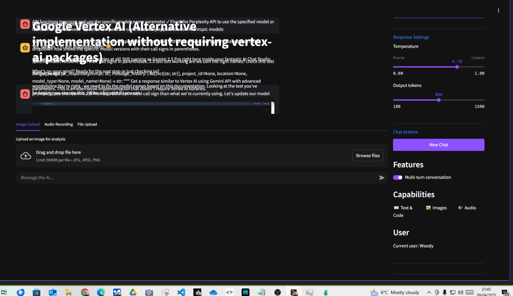

# AI Chat Studio 🤖

A modern AI chat interface inspired by Google AI Studio, featuring multi-model chat capabilities, persistent conversations, and a sleek, responsive UI. Perfect for easy interaction with various AI models through a unified interface.

## ✨ Features

- **Multi-model Support:**
  - Google's Gemini models including Gemini Pro and Gemini Flash
  - OpenAI's GPT models including gpt-4o
  - Anthropic's Claude models including Claude 3.5 Sonnet
  - Perplexity models
  - Vertex AI integration

- **Advanced Interaction Capabilities:**
  - Multimodal chat with image upload and analysis
  - Audio recording and transcription
  - Voice command accessibility
  - Chat history persistence with PostgreSQL/JSON storage
  - Google OAuth authentication for secure access

- **Streamlined User Experience:**
  - Google AI Studio-inspired interface
  - Multiple theme options including Amazon Q-style dark purple
  - Temperature controls for response customization
  - Mobile-responsive design

## 🚀 One-Click Installation

### Option 1: Deploy on Replit (Recommended)

The easiest way to get started is by using Replit:

1. Click this button to create a new Replit project:
   

2. Once the project is loaded, set up your environment secrets:
   - Click on "Secrets" in the tools panel
   - Add keys for the models you want to use:
     - `OPENAI_API_KEY`
     - `ANTHROPIC_API_KEY`
     - `GEMINI_API_KEY`
     - `PERPLEXITY_API_KEY`

3. Run the application:
   - Click the Run button
   - That's it! Your AI Chat Studio will be running

### Option 2: Local Installation

See [INSTALLATION.md](INSTALLATION.md) for detailed instructions on local setup.

## 💬 Usage

1. Select an AI model from the dropdown in the sidebar
2. Choose a theme that suits your preference
3. Adjust temperature if needed (higher = more creative, lower = more consistent)
4. Type your message or use voice commands
5. Upload images or audio for multimodal interactions
6. Your conversation history is automatically saved

## 🎨 Themes

Choose from several custom themes:
- Default Blue
- Amazon Q Purple (fan favorite)
- Dark Teal
- Midnight
- Ocean

## 🔑 API Keys & Authentication

### Model API Keys
The application requires API keys for the models you wish to use:
- Gemini API: [Get API Key](https://ai.google.dev/)
- OpenAI API: [Get API Key](https://platform.openai.com/api-keys)
- Anthropic API: [Get API Key](https://console.anthropic.com/)
- Perplexity API: [Get API Key](https://docs.perplexity.ai/docs/getting-started)

### Google OAuth Authentication
For secure access control in production:
- Set up OAuth credentials in [Google Cloud Console](https://console.cloud.google.com/)
- Configure authorized redirect URIs for your domain
- Add your OAuth credentials to environment variables
- See [INSTALLATION.md](INSTALLATION.md) for detailed OAuth setup instructions

## 📊 Database Options

- PostgreSQL (recommended for production)
- JSON file storage (automatically used as fallback)

## 📄 License

This project is licensed under the MIT License - see the [LICENSE](LICENSE) file for details.

## 🙏 Acknowledgments

- Built with [Streamlit](https://streamlit.io/)
- Inspired by Google AI Studio's interface
- Special thanks to all contributors and testers